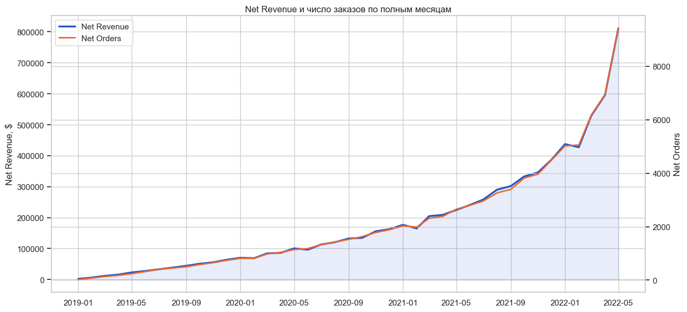
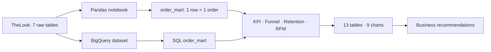
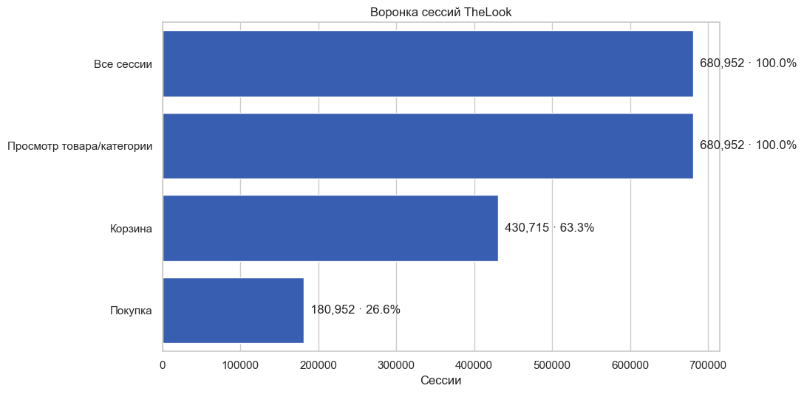
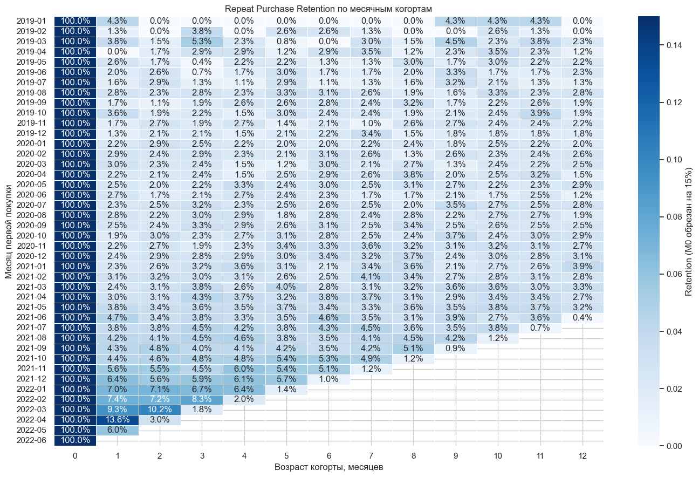
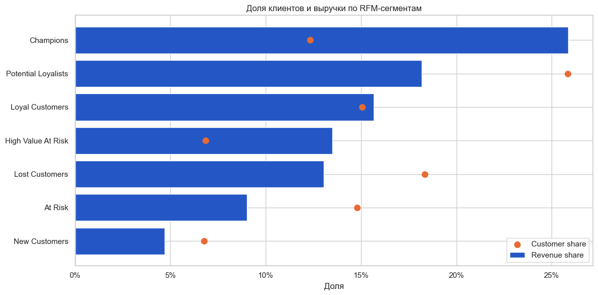
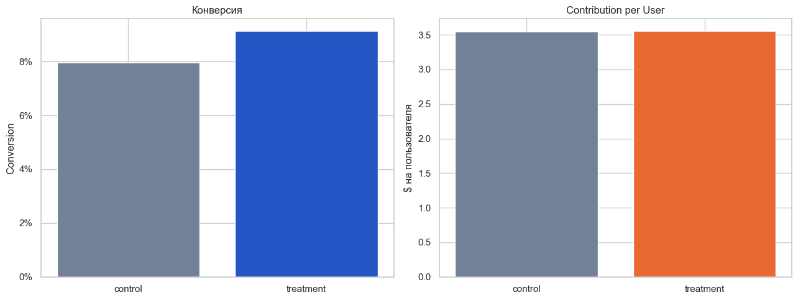

# TheLook Growth & Retention Analytics

[](https://www.python.org/)
[](https://pandas.pydata.org/)
[](sql/README.md)
[](notebooks/01_thelook_pandas_analysis.ipynb)
[](LICENSE)

**End-to-end портфельный проект продуктового аналитика:** от сырых данных и контроля качества до продуктовых метрик, когортного retention, RFM, статистических проверок, A/B-симуляции и рекомендаций бизнесу.

> **Главный вопрос проекта:** где fashion-маркетплейс теряет выручку и повторных покупателей — и какие действия способны улучшить экономику продукта?

[Открыть выполненный Pandas notebook](notebooks/01_thelook_pandas_analysis.ipynb) · [Посмотреть BigQuery SQL](sql/README.md) · [Прочитать case study](docs/CASE_STUDY.md) · [Подготовиться к защите](docs/INTERVIEW_GUIDE.md)



## Executive summary

Анализ охватывает **7 связанных таблиц**, **100 000 пользователей**, **124 923 заказа** и около **2,4 млн событий**.

| KPI | Результат | Интерпретация |
|---|---:|---|
| Net Revenue Proxy | **$8,07 млн** | Выручка после исключения отмен и возвратов |
| Gross Profit Proxy | **$4,19 млн** | Выручка за вычетом себестоимости товара |
| Gross Margin | **51,9%** | Маржа до маркетинга, логистики и налогов |
| Return Rate | **11,8%** | Существенная зона потери выручки |
| Cancellation Rate | **15,0%** | Каждый шестой-седьмой заказ отменяется |
| Repeat Purchase Rate | **30,4%** | Доля покупателей с двумя и более net-заказами |
| M1 Retention | **5,1%** | Повторная покупка в следующий месяц остаётся низкой |
| Session → Purchase | **26,6%** | Конверсия сессий в покупку в синтетических данных |

### Решения, которые следуют из анализа

1. Запустить CRM-механику второй покупки в первые 30 дней и контролировать **M1 retention**.
2. Разобрать причины возвратов в категории **Plus**, где Item Return Rate достигает **12,8%**.
3. Сократить запас старше 180 дней в **Houston TX** — около **$1,01 млн** замороженной себестоимости.
4. Работать отдельно с RFM-сегментами: `Champions` дают **25,9% выручки**, составляя только **12,3% покупателей**.
5. Бесплатную доставку сначала проверять ограниченным пилотом: в симуляции conversion выросла, но экономический эффект почти нейтрален.

## Что демонстрирует проект

| Область | Реализация |
|---|---|
| Python / Pandas | Загрузка CSV, очистка, `merge`, `groupby`, `agg`, `crosstab`, `pivot_table`, `qcut` |
| SQL / BigQuery | Копирование публичных таблиц, контроль качества, `order_mart`, KPI, funnel, retention, RFM |
| Product Analytics | Revenue, margin, cancellation, returns, repeat purchase, funnel и cohort retention |
| Customer Analytics | RFM-сегментация и оценка вклада сегментов в выручку |
| Statistics | Chi-square для связи доставки и возвратов; z-test конверсии |
| A/B Testing | Primary metric, guardrail, доверительный интервал и решение о пилоте |
| Visualization | 9 воспроизводимых графиков Matplotlib / Seaborn |
| Data Quality | Проверка ключей, связей, хронологии, гранулярности и контрольных сумм |
| Engineering | Раздельные Pandas/SQL-слои, экспорт результатов, manifest и validation script |

## Архитектура



Ключевой принцип — сначала агрегировать позиции заказа до `order_id`, затем присоединять заказы и пользователей. Это предотвращает размножение строк и завышение KPI.

## Аналитические блоки

### 1. Data Quality и витрина заказов

- проверка уникальности и пропусков первичных ключей;
- проверка связей `orders → users`, `order_items → orders/products`;
- контроль логики дат доставки и возврата;
- `merge(..., validate=...)` и тест «одна строка = один заказ».

### 2. Выручка и экономика

- GMV, Net Revenue, Gross Profit и Gross Margin;
- динамика по полным месяцам;
- отмены, возвраты, AOV и размер корзины.

### 3. Поведение покупателей

- session funnel и сегментация по источнику/браузеру;
- repeat-purchase cohort retention;
- RFM и вклад сегментов в клиентскую базу и выручку.

### 4. Операции и статистика

- риск залежавшихся запасов по распределительным центрам;
- связь скорости доставки и возвратов;
- учебная A/B-симуляция бесплатной доставки.

| Воронка | Retention |
|---|---|
|  |  |

| RFM | A/B test |
|---|---|
|  |  |

## Быстрый просмотр для работодателя

1. **2 минуты:** прочитать Executive summary выше.
2. **5 минут:** открыть [выполненный notebook](notebooks/01_thelook_pandas_analysis.ipynb) и посмотреть результаты без запуска.
3. **5 минут:** изучить [order mart](sql/02_order_mart.sql), [KPI](sql/03_executive_kpi.sql), [retention](sql/06_retention.sql) и [RFM](sql/07_rfm.sql).
4. **10 минут:** прочитать [case study](docs/CASE_STUDY.md) и [словарь метрик](docs/METRICS_DICTIONARY.md).

## Структура репозитория

```text
thelook-growth-analytics/
├── data/README.md                       # источник и правила хранения данных
├── docs/
│   ├── CASE_STUDY.md                    # бизнес-кейс и решения
│   ├── INTERVIEW_GUIDE.md               # материал для защиты проекта
│   └── METRICS_DICTIONARY.md            # определения KPI
├── notebooks/
│   └── 01_thelook_pandas_analysis.ipynb # выполненный Pandas-анализ
├── outputs/pandas/
│   ├── figures/                         # 9 графиков
│   ├── tables/                          # 13 итоговых CSV
│   ├── executive_summary.md
│   └── run_manifest.json
├── scripts/validate_project.py          # быстрая техническая проверка
├── sql/                                 # 10 BigQuery SQL-файлов
├── LICENSE
├── README.md
└── requirements.txt
```

## Как воспроизвести Pandas-анализ

```bash
git clone https://github.com/sureasguuds9-prog/thelook-growth-analytics.git
cd thelook-growth-analytics

python3 -m venv .venv
source .venv/bin/activate
pip install -r requirements.txt
jupyter lab notebooks/01_thelook_pandas_analysis.ipynb
```

Если локальных CSV нет, notebook автоматически скачает публичный snapshot. Большие исходные данные не хранятся в Git-репозитории.

## Как воспроизвести SQL-анализ

1. Открыть [BigQuery](https://console.cloud.google.com/bigquery).
2. Заменить `your-gcp-project-id` на ID своего Google Cloud проекта.
3. Выполнить SQL-файлы по порядку от `00_setup.sql` до `09_validation.sql`.

Подробная инструкция находится в [sql/README.md](sql/README.md).

## Проверка проекта

Локальная быстрая проверка notebook, сохранённых результатов и BigQuery SQL:

```bash
pip install nbformat sqlglot
python scripts/validate_project.py
```

Скрипт проверяет структуру notebook, сохранённые результаты, BigQuery SQL и основные контрольные условия проекта.

## Ограничения

- TheLook — синтетический учебный датасет; A/B-тест также является симуляцией.
- Net Revenue и Gross Profit — аналитические proxy без маркетинга, налогов, платежей и стоимости доставки.
- Последний месяц неполный и исключён из сравнений динамики.
- Наблюдательные связи не доказывают причинно-следственный эффект.
- Результаты не следует переносить на реальный бизнес без повторной проверки данных и определений метрик.

## Автор

**Ярослав Зинченко** — начинающий продуктовый / дата-аналитик.
GitHub: [@sureasguuds9-prog](https://github.com/sureasguuds9-prog)

Если проект оказался полезен, можно поставить ⭐ — это помогает развитию портфолио.
